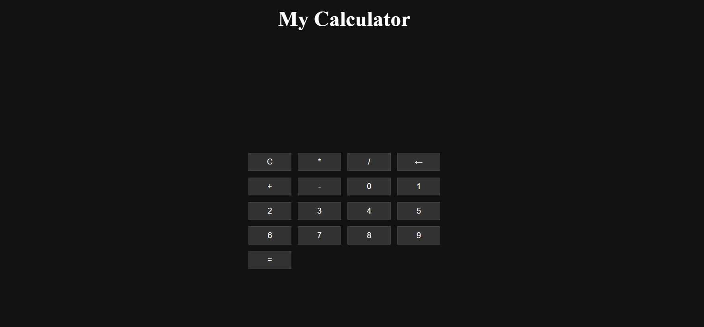

# javascript2
# Calculator Project

A simple, functional calculator built using HTML, CSS, and JavaScript. This project supports basic arithmetic operations like addition, subtraction, multiplication, and division.

## Features
- Clear button to reset the input.
- Responsive design for different screen sizes.
- Handles valid and invalid expressions gracefully.

## Preview

## Technologies Used
- HTML5
- CSS3
- JavaScript (Vanilla)
## Help 
 Link to the project directly withought having to clone https://diamond-commit.github.io/javascript2/
 ## Cloning 
  If you want to clone to Your desktop locally here's the link https://github.com/diamond-commit/javascript2.git
  ## Contributions
  Contributions are always welcome! If you'd like to contribute, feel free to fork the repository, make your changes, and submit a pull request. Please ensure your code follows best practices and is well-documented.

